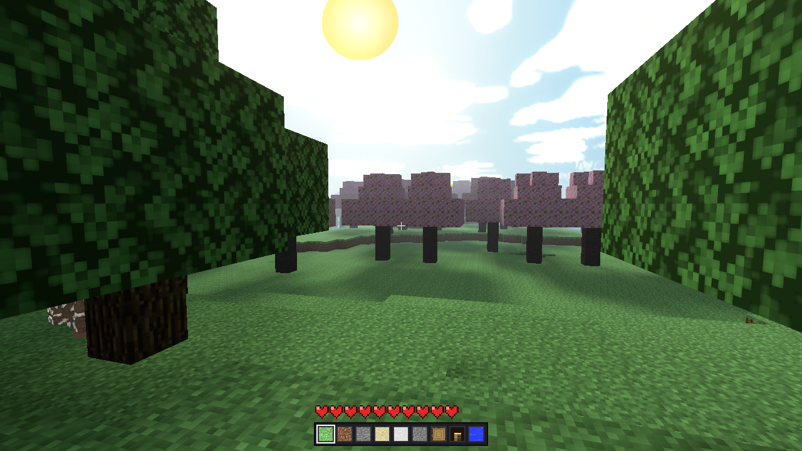
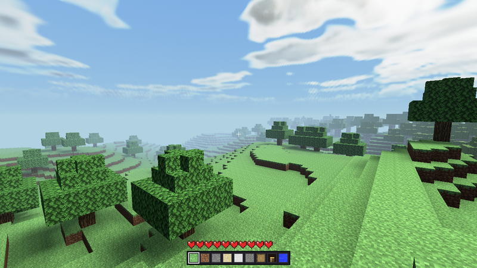
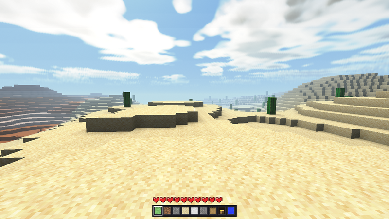
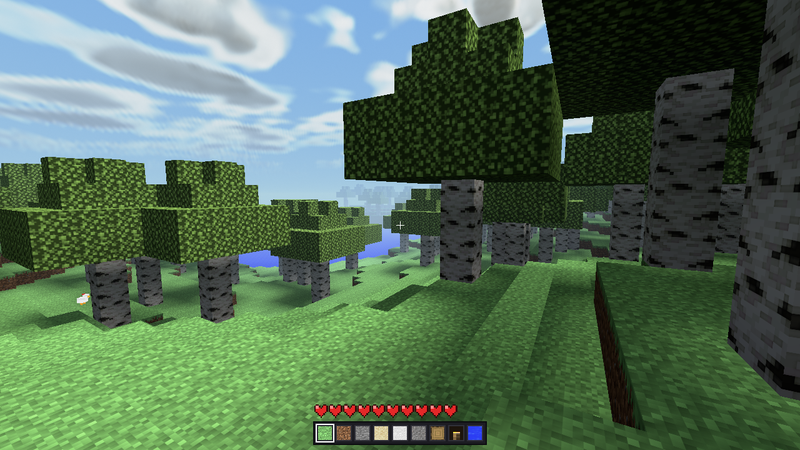

<div align="center">

# ⛏️ voxel

### A Minecraft-style survival world, software-rendered on the CPU — written entirely in [**Axle**](https://axle-lang.dev)

No GPU. No engine. Every pixel of terrain, sky, water and mobs is shaded by hand across worker threads, over an infinite streamed voxel landscape.

<p align="center">
  <a href="https://axle-lang.dev"></a>
  <a href="https://axle-lang.dev"></a>
</p>
<p align="center">
  
  
  
  
</p>

<sub><a href="#-highlights">Highlights</a> · <a href="#%EF%B8%8F-controls">Controls</a> · <a href="#-quick-start">Quick start</a> · <a href="#%EF%B8%8F-architecture">Architecture</a> · <a href="#%EF%B8%8F-how-it-works">How it works</a> · <a href="https://axle-lang.dev">Axle ↗</a></sub>

</div>

---



<div align="center"><em>The lighting engine: warm sunlit ground, soft shadows under the canopy, a sun glow with god-rays and a graded atmospheric sky — all on the CPU.</em></div>

<table>
<tr>
<td width="33%"></td>
<td width="33%"></td>
<td width="33%"></td>
</tr>
<tr>
<td align="center"><em>Forest</em></td>
<td align="center"><em>Desert</em></td>
<td align="center"><em>Coast</em></td>
</tr>
</table>

## 📊 At a glance

| | |
|---|---|
| **Language** | 100% [Axle](https://axle-lang.dev) — game *and* platform layer; nothing is C, nothing is vendored |
| **Rendering** | Software rasteriser on the CPU — perspective-correct 128 px HD textures, mip-chain + anisotropic filtering, shared z-buffer |
| **World** | Infinite, streamed voxel terrain · ~18 biomes · continentalness / erosion / peaks-and-valleys noise |
| **Lighting** | Flood-filled sky + block light with AO · day/night sun · soft shadows · god-rays · bloom · atmospheric sky |
| **Simulation** | Voxel-accurate AABB physics · fall/drown damage + regen · falling sand & water flow · texture-skinned mobs |
| **Threads** | Audio mixer · light engine · tiled triangle rasteriser — each on its own thread |
| **Architecture** | A reusable 6-kernel engine (`src/kernel`) + injectable game content (`src/game`), meeting only through capability seams |

## ✨ Highlights

- 🌍 **Infinite, streamed terrain** — ~18 Minecraft-like biomes (ocean, beach, plains, forest, birch & cherry groves, jungle, bamboo, savanna, badlands, swamp, taiga, snowy, mountains, mushroom fields, frozen ocean) shaped by continentalness / erosion / peaks-and-valleys noise, dressed with trees, oceans and thin variable-depth snow.
- 🧍 **You are a real entity** — a voxel-accurate AABB body: gravity, jumping, swimming, auto-stepping ledges, fall & drowning damage, and health that regenerates. Toggle creative free-flight anytime.
- 💡 **A real lighting engine** — a propagating sky + block light field with ambient occlusion, a day/night cycle with a moving sun, soft directional shadows, one-bounce colour bleed, screen-space god-rays, bloom and an atmospheric sky.
- 🐔 **Texture-skinned mobs** — chickens, sheep, cows, pigs and creepers wander, graze, flee and die, lit by the same scene light.
- 🎨 **HD software rasteriser** — perspective-correct 128 px textures, a mip-chain with anisotropic filtering, near-plane clipping and a shared z-buffer — no GPU touched.
- 🧵 **Threaded by design** — audio mixing, the light engine and the triangle rasteriser each run on their own threads, so it stays smooth under load.

## 🕹️ Controls

| Input            | Action                                   |
|------------------|------------------------------------------|
| Mouse            | look around (captured)                   |
| `W` `A` `S` `D`  | walk                                     |
| `LCtrl`          | sprint                                   |
| `Space`          | jump / swim up / fly up (creative)       |
| `LShift`         | fly down (creative)                      |
| Left-click       | dig the block / attack the mob in front  |
| Right-click      | place the held block                     |
| `1`–`9`          | select hotbar slot                       |
| `F3` + `F4`      | toggle survival ↔ creative (free flight) |
| `Esc` / close    | quit                                     |

## 🚀 Quick start

```bash
git clone --recurse-submodules <repo-url>   # the platform layer is a submodule
cd voxel-axle
axle --version                              # must print 0.12.1 or newer
axle run                                    # compile and play
```

That is the whole list: a compiler, and this repo. There is no library to
install, no DLL to copy, and no `[link]` section to point at a package
manager — the platform layer is [**smalt**](https://github.com/Axle-lang/smalt), which is Axle calling
Win32 or X11 + ALSA directly and rides along as a submodule.

## 🧩 Built with Axle

This project is a love letter to [**Axle**](https://axle-lang.dev) — a modern systems language with an LLVM backend, traits, generics, structs and first-class concurrency. The whole game is written in Axle — world gen, physics, lighting, the software rasteriser — and so is everything under it: **smalt** opens the window, drains the event queue, blits the framebuffer and feeds the sound card, in Axle, by calling the operating system.

It also draws the overlay now. The HUD, the heart row, the hotbar and the pause menu go through smalt's clipped `Frame` and its baked `BitmapFont`, and the audio device is pumped by smalt's own `mixerLoop` behind a lock the mixer takes itself. Four things this game used to carry — a `Canvas`, a 5×7 bitmap font, a fixed-timestep clock and a spinlock around the mixer — turned out to be platform-layer problems that every program on smalt was solving again, so they went where they belonged: **628 lines left this repository and 238 came back.**

> **New to Axle?** Start at **[axle-lang.dev](https://axle-lang.dev)** — install guide, language tour and docs.

## 📦 Prerequisites

Two things: the **Axle compiler** (v0.12.1+) and this repo **with its
submodule**.

### Clone the repo and its platform submodule

The platform layer — window, event queue, framebuffer blit, monotonic
clock, software audio mixer, whole-file reads and raw buffers — is
[**smalt**](https://github.com/Axle-lang/smalt), pinned here as the
**`vendor/smalt` git submodule**. Its `src/` compiles together with ours
(`use smalt::…`), so a clone without the submodule leaves `vendor/smalt`
empty and the build stops before reading a line of source:
``dependency `smalt` … has no axle.toml at …/vendor/smalt``.

```bash
# fresh clone — pull the submodule at the same time
git clone --recurse-submodules <repo-url>

# already cloned without it? initialise it after the fact
git submodule update --init --recursive
```

Later, to move to a newer platform layer:
`git submodule update --remote vendor/smalt`, then commit the new pin.

### Install Axle

<details>
<summary><b>Per-platform Axle setup →</b></summary>

<br>

- **Windows / Linux** — installer and packages at
  [axle-lang.dev](https://axle-lang.dev).
- **From source** —
  ```bash
  git clone <axle-repo> && cd axle
  cargo build --release -p axle_cli   # -> target/release/axle (add to PATH)
  ```
- **macOS** — build from source (see [axle-lang.dev](https://axle-lang.dev)).

</details>

### What the produced binary links

Nothing you have to install on Windows: `kernel32`, `user32`, `gdi32` and
`winmm` ship with the OS.

On Linux it links `libX11` and `libasound`, which every desktop
distribution already has — `libx11-6` and `libasound2` are on the box if
anything with a window or a sound has ever run on it. Building from a
bare container needs their `-dev` packages
(`sudo apt install libx11-dev libasound2-dev`), which is a *build*
prerequisite and not a runtime one.

## 🛠️ Build & run

From this directory, with the submodule initialised and
`axle --version` reporting 0.12.1+:

```bash
axle run                         # compile and play, in one step
axle build && ./target/voxel     # or in two — on Linux / macOS
axle build; .\target\voxel.exe   # …and on Windows
```

The extension follows the machine you are *building on*, not the target
you are building for: the same `axle build` writes `target/voxel.exe` on
Windows and `target/voxel` everywhere else. `axle run` picks the right
one for you, which is why it is the line above.

`atlas.raw` must sit next to the produced binary or one directory up —
it is read at run time, so textures can be re-baked without rebuilding.

Cross-compiling is the same command with a target:

```bash
axle build --target x86_64-unknown-linux-gnu
```

The platform overlay follows: the Linux build compiles smalt's X11 and
ALSA backend and never sees a line of Win32. The *file name* does not —
a Linux binary cross-built on Windows is still written to
`target/voxel.exe`, because the extension is chosen by the host. Rename
it when you ship it, or let the release workflow build it on Linux.

## 🏛️ Architecture

The code is split into two layers that meet only through **capability contracts** — a reusable voxel **engine** and the **game** that dresses it:

```
   ┌──────────────────────────── src/main.axle ────────────────────────────┐
   │  composition root: opens the window, wires the kernels, injects the    │
   │  game content, then runs the input → simulate → render loop            │
   └────────────────────────────────┬───────────────────────────────────────┘
                                     │  builds & injects
        ┌────────────────────────────┴─────────────────────────────┐
        ▼                                                            ▼
┌───────────────── src/kernel/ ─────────────────┐        ┌──────── src/game/ ────────┐
│  the reusable ENGINE — six trait-based kernels │        │  the APP — all content    │
│                                                │        │                           │
│   kmath    vectors + math helpers              │        │  world/  biomes, terrain  │
│   kblock   block table (id → tile/colour)      │        │          & tree generation│
│   kworld   streamed chunks, meshing, lighting  │        │  entities/ mob roster +   │
│   kentity  Entity/Player/Mob physics + AI      │        │          per-species skins│
│   kio      clock, input, threaded audio        │        │  start / ray / tick       │
│   krender  software rasteriser, sky, HUD       │        │                           │
│                                                │        └───────────┬───────────────┘
│   seams.axle — the kernel↔kernel contracts     │◄───────────────────┘
└────────────────────────────────────────────────┘   game implements the app→kernel
                                                       injection seams (below)
```

### Seams — the capability contracts

`src/kernel/seams.axle` is the single source of truth for how the kernels talk to each other. Every seam is a **small, single-responsibility capability trait** (one job each), with convenience **bundles** composing them, so a provider conforms once and a consumer depends on only the narrowest capability it actually uses:

| Provider | Bundle | Fine-grained capabilities |
|----------|--------|---------------------------|
| `kworld` · ChunkManager | `VoxelQuery` | `VoxelReader` + `CollisionField` + `Heightfield` |
| `kworld` · ChunkManager | `VoxelEdit` | `VoxelWriter` + `LightMutator` + `ChunkStreamer` + `DayCycle` + `LightThread` |
| `kworld` · ChunkManager | `LightSample` | `BlockLightField` + `SkyLightField` + `SunLightField` + `BounceLightField` |
| `kentity` · Mob | `ActorVisual` | `Kinded` + `Animated` (+ pose / flash / fuse) |

The picker, for instance, takes a `dyn VoxelQuery`, not the concrete `ChunkManager` — so nothing in the interaction layer names an engine type.

### Content flows into the engine, never the other way

The engine never names a concrete biome, ore rule or animal. Instead the **game injects** its content at startup through two *app→kernel* seams, each declared beside the kernel that consumes it (so each kernel stays self-contained):

- **`Generator`** (`kworld::manager`) — `TerrainGen` (biome tables, ore & tree rules) is injected via `ChunkManager.attachGenerator`, and the streamer drives it through the seam.
- **`MobSpawner`** (`kentity::mob`) — `Fauna` (which species exist and their spawn weights) is injected via `MobManager.attachSpawner`, and the population manager builds mobs through it.

### Physics through inheritance

`Player` and `Mob` are genuinely the same *kind* of thing physically: both fall, both stand on terrain, both step up one-block ledges, both can be hurt. That shared behaviour lives once in `Entity` (kentity) and is reused by both subclasses — `Player.update` and `Mob.aiStep` only decide *what horizontal move to feed the shared `tick`*.

```
                 ┌────────────┐
                 │   Entity   │  pos, velY, hp, radius, gravity + VOXEL
                 │  (kentity) │  AABB collision, auto-step up / step-down,
                 └─────┬──────┘  damage / heal
            extends    │    extends
        ┌──────────────┴───────────────┐
   ┌────▼─────┐                    ┌────▼────┐
   │  Player  │ FPS camera, input, │   Mob   │ AI + skins (chicken / sheep /
   │          │ jump / swim, fall  │         │ cow / pig / creeper), wander /
   │          │ & drown & regen,   │         │ graze / flee / die
   │          │ creative flight    │         │
   └──────────┘                    └─────────┘
```

Adding a new animal is a new `Entity` subclass in `game/entities/` plus a spawn weight in `Fauna` — the engine is untouched.

### Value structs over scalar sprawl

Hot geometry and call-sites are bundled in value `struct`s instead of long argument lists: **`IVec3`** for integer cells and **`Vec3`** for float positions/directions (both in `kmath/vec3.axle`), plus `FrameBuf`, `RasterTri`, `MipAtlas`, the sky's `DayState` / `SunScreen`, the mob pass's `MobScene`, and the light flood's `LightRemoval`.

The 2-D one used to be ours too — a `Canvas` bundling `(base, w, h)` so the HUD primitives did not thread three scalars. It is smalt's [`Frame`](vendor/smalt/src/render/frame.axle) now, which is the same bundle plus a clip rectangle: a widget that overruns its box is cut at the edge instead of painting over its neighbour, and the address it carries has no owner, so it cannot be the buffer's second one.

### Source layout

A `use` that crosses folders is written from the source root with a `crate::` prefix (like Rust); same-folder siblings import by bare name.

```
vendor/smalt               the platform layer — a git submodule whose src/
                           compiles with ours (window, renderer, audio mixer, raw
                           memory, file IO); `use smalt::…`
src/
  main.axle                composition root: window + buffers + worker threads,
                           wire the kernels, inject the game content, run the loop
  configs/                 one class of `static` tunables per area — Screen,
                           Render, Atlas/Tile, Light, Daylight, Water, Noise,
                           World, Motion, Mobs, Trees, Gameplay, Health, Hotbar,
                           Audio — plus the Block / BiomeId / TreeKind / MobKind
                           / FaceDir / AudioMaterial enums. Change the feel here

  kernel/                  the reusable ENGINE (never names game content)
    seams.axle             the kernel↔kernel capability contracts (single source
                           of truth); app→kernel injection seams live with kworld/kentity
    kmath/    mathx · vec3                 math helpers, Vec3 / IVec3
    kblock/   blocks                       block table: id → tile/colour/predicates,
                                           blockBoxHeight category helpers
    kworld/   voxstore · lightstore        raw voxel field · per-voxel light volumes
              noise                        value noise + fbm terrain fields
              chunkmesher · meshbuf        voxel → face/torch/collision-top mesher
              blocksim                     falling sand/gravel, water flow
              manager                      ChunkManager: streamed chunks, meshing,
                                           the block+sky LIGHT engine (own thread),
                                           break/place — provides the VoxelQuery /
                                           VoxelEdit / LightSample seams
    kentity/  entity · player              Entity base (physics) · Player
              mob · mobs                   Mob AI base + MobManager; declares MobSpawner
    kio/      input · sfx                  keyboard axes · game audio cues
                                           (pacing is smalt's `FramePacer`, the pump
                                           thread and the mixer lock are smalt's too)
    krender/  color                        the one tint that is a game decision, and
                                           the `Widget` seam (packing, blending and
                                           the clipped surface are smalt's)
              raster                       triangle rasteriser + z-buffer, mip-chain,
                                           anisotropic sampling (RasterTri / MipAtlas)
              sky                          day/night + atmospheric sky (DayState by value)
              mobview · selection · bloom  mob box-models · block wireframe · glow pass
              render                       core world pass: project + clip + shade every
                                           face, rasterise in parallel column bands
              health · hotbar · hud · menu heart row · inventory bar · HUD · pause menu
                                           (all drawn through smalt's `Frame` and
                                           `BitmapFont` — no font or clip of our own)

  game/                    the APP — all content, injected into the engine
    world/    biomes                       climate → biome tables (all ~18 in one module)
              terraingen                   TerrainGen: implements the `Generator` seam
              treegen                      tree / mushroom canopy stamping
    entities/ fauna                        Fauna: implements the `MobSpawner` seam
              chicken · cow · pig ·        per-species skins & behaviour
              sheep · creeper
    start.axle               start-position search + facing yaw
    ray.axle                Picker: look-ray voxel pick with real per-block boxes
    tick.axle               fixed-timestep scheduler (Scheduler seam)
```

## ⚙️ How it works

1. **Streaming.** A `span × span` ring of chunk slots is addressed by chunk-coordinate modulo `span`, so a chunk keeps its slot as the player moves; crossing a border only regenerates the newly entered chunks.
2. **Generation.** Per column, low-frequency *continentalness* raises land out of the ocean, *erosion* flattens or roughens it, and a ridged *peaks-and-valleys* term carves mountains and valleys; height splines tie them into coherent 1.21-style landforms. A `temperature × humidity × elevation` climate grid picks the biome (game content, behind the `Generator` seam), which decides surface/filler blocks and tree density. Cold biomes lay a thin, noise-varied **snow layer** on the ground and dust the canopies.
3. **Physics.** `Entity` integrates gravity into `velY` and resolves collision against the **real voxel field**: a `radius`-wide, `height`-tall AABB tested against every overlapping voxel, so you can't clip a cliff or a trunk — and you *can* walk under overhangs and into dug tunnels. Gentle ledges (≤ `stepHeight`) auto-step up, and a **step-down assist** eases small drops. **Partial-height blocks** (snow today, slabs later) occupy their true box — one authority, `blockBoxHeight` (a `CollisionField` capability), feeds collision, meshing, the picker and the selection outline alike. Hard landings become fall damage; submersion drains breath then health; time without damage regenerates it.
4. **Lighting.** A flood-filled **sky + block light** field gives every voxel corner a smooth (Gouraud) light value with ambient occlusion; torches inject warm block light. A **day/night cycle** moves a sun (and a procedural sun/moon disc) across an **atmospheric sky gradient**; **directional sun shadows** are cast with a soft, smoothed penumbra, warm sunlight reads against cool shade, and a one-bounce colour tint bleeds nearby surfaces. Bright pixels get **bloom**, and the sun throws screen-space **god-rays**. Mobs are lit by the same scene light. The whole field is recomputed on a **dedicated thread**.
5. **Rendering.** World faces are near-plane clipped (so hugging a block never tears a hole), projected (`1/z`) and filled with their **128 px HD Minecraft texture** (perspective-correct sampling, a mip-chain and **anisotropic filtering**), shaded by the baked corner light + shadows. Water draws as a sloped, scrolling surface with specular + Fresnel. Mobs are stacks of textured boxes with a walk-cycle bob, sharing the world z-buffer; a struck mob flashes red. The heart HUD, hotbar and crosshair are painted on top.
6. **Threading.** **Audio** mixes on its own thread (no crackle under load), the **light** engine recomputes on its own thread, the world triangle queue is rasterised in **vertical tiles** across worker threads, and the sky / god-ray / bloom post-passes are split into row bands (`spawn` → `join`).
7. **Mobs.** `MobManager` keeps a live `dyn ActorVisual[]`, spawns animals on dry land in a ring around the player (species chosen by the injected `Fauna`), steps each one's AI, despawns the distant, and resolves a left-click into damage on the nearest mob in the view cone. Each eases toward a target heading, alternates wandering with grazing, hops now and then, and bolts when hit. Killing one plays a `dying` collapse before removal.

## 🖼️ Textures

Real Minecraft block textures are baked into `atlas.raw` as a vertical strip of **128 px (HD)** tiles (grass, dirt, stone, sand, snow, gravel, oak/birch logs, leaves, water, …). The engine **loads `atlas.raw` at runtime** (`Assets::loadAtlas`, tried from the project dir or `target/`) — it is not embedded in the source, so textures can be re-baked without rebuilding. `kblock` maps a block face to its tile, the mesher stores the tile per face, and the rasteriser samples it through the mip-chain with anisotropic taps. Re-bake with `python bake_atlas.py`.

**Mobs** are skinned from the Minecraft entity textures under `assets/textures/entity/`. `bake_mobs.py` crops a tile per body part and appends them to the atlas; `Atlas::USE_MOB_TEXTURES` toggles textured vs flat-colour mobs.

## 🧷 Seams for new features

- **New block** — id in `configs/blocks`, tile/colour & predicates in `kblock`, place it in `game/world`.
- **New partial block** (slab, carpet) — one `match` arm in `blockBoxHeight` plus listing it in `kblock.isPartialShape`; collision, meshing, picking and the selection outline pick it up for free.
- **New biome** — a climate band + surface/filler + tree density in `game/world/biomes` (no engine change).
- **New animal** — a new `Entity` subclass in `game/entities/`, a spawn weight in `Fauna`, and a `draw*` case in `krender/mobview`.
- **Editing the world** (dig / place) — the `VoxelEdit` seam (`breakAt` / `placeAt`) rewrites the chunk's voxel field and re-meshes the affected slots; the look-ray `Picker` picks the targeted voxel against its real per-block box.

## 📝 Notes / limitations

- Collision is **voxel-accurate**: the body AABB is tested against every overlapping voxel (trunks and placed blocks included; leaf canopies stay passable). Partial blocks use their real box height.
- Edits are not persisted: a chunk that streams out of the loaded ring and back is regenerated, discarding edits made to it.
- The loop runs a **fixed timestep** (`World::TICK_HZ`, default 60): the simulation advances by real elapsed time (catching up after a slow frame), so movement is frame-rate independent, and the pacer caps the CPU instead of relying on v-sync. Both halves are smalt's `FramePacer` — `tick(clock)` sleeps to the frame boundary and measures, `steps()` drains that same measurement into whole simulation steps, so the two cannot drift into separate timelines.
- `--snap [ms]` plays for that long, writes `voxel.bmp` beside the binary and quits — a capture for a report, or for a script, without anyone standing over the machine at the right moment.
- The start column is random per run and printed; `--at <x> <z>` replays one. The world itself is still one fixed seed — see **Build & run** for why that is a bigger change than it looks.
- smalt's own limits, and what each would take to lift, are in [`vendor/smalt/LIMITATIONS.md`](vendor/smalt/LIMITATIONS.md).
- `axle.toml`'s lib path is machine-specific; DLL + `atlas.raw` deployment next to the binary is manual.

---

<div align="center">

Built with ❤️ and zero GPUs in **[Axle](https://axle-lang.dev)** · learn the language at **[axle-lang.dev](https://axle-lang.dev)**

</div>
